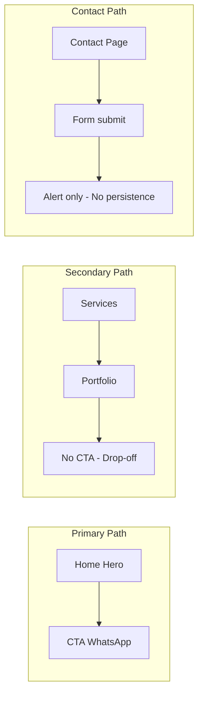

# Business Requirements Document (BDR)
# Vanilla Capital UX Optimization

**Version:** 1.0  
**Date:** March 2025  
**Status:** Draft for HLD handoff

---

## 1. Executive Summary

### Business Rationale

Vanilla Capital operates in the high-ticket financial services space. Each lead and conversion carries significant value. The public website must maximize qualified lead capture while reinforcing trust and regulatory credibility. Current gaps in conversion paths, trust signals, accessibility, and performance directly reduce lead quality and volume.

### Scope

- **In scope:** Public-facing pages—Home (Hero, Strategic Partners, Services), Portfolio, About, Contact, Compliance—and all conversion flows (WhatsApp, contact form, sign-in, suitability/registration entry points)
- **Out of scope:** Backoffice UX, suitability/registration form content or validation logic, compliance document content, A/B testing infrastructure

### Expected Impact

- Qualified lead capture through functional contact form and CTAs at every decision point
- Trust reinforcement via regulatory badges and transparent next-step communication
- WCAG 2.1 AA compliance for accessibility and inclusivity
- Performance improvements to reduce bounce and support Core Web Vitals

---

## 2. User Personas

### 2.1 HNW Individual / Family Office

High-net-worth investor seeking wealth protection and asset allocation. Values discretion, expertise, and personal service. May be accompanied by advisors. Expects premium presentation and clear pathways to engagement.

### 2.2 CFO / Corporate Decision-Maker

Corporate finance professional evaluating investment or advisory services. Needs concise, credible information and fast access to contact or scheduling. Typically researches during business hours and shares materials with board or audit.

### 2.3 Multi-Stakeholder (Advisors, Compliance)

Buying group including advisors, compliance officers, and family members. Each stakeholder has different priorities. Site must support long research sessions, printable/sharable content, and clear regulatory transparency.

---

## 3. User Journeys

### 3.1 Primary Path (Working)

```
Home (Hero) → CTA "Contact" → WhatsApp (pre-filled message) → Conversation
```

This path is functional. Hero CTA links to WhatsApp with a pre-filled message. No changes required for the flow itself; improvements focus on clarity (aria-label, H1) and trust reinforcement.

### 3.2 Secondary Path (Broken—Drop-off)

```
Home (Services carousel) → "Learn more" → Portfolio → [No CTA] → Drop-off
```

Users who engage with services reach the Portfolio page and find no call-to-action (contact, WhatsApp, or schedule a call). This creates a dead end and loses qualified leads.

### 3.3 Tertiary Path (Broken—No Persistence)

```
Contact page → Fill form → Submit → Alert "Success" → [No backend] → Data lost
```

The contact form uses `setTimeout` and `alert`; no data is persisted. Users believe they submitted; the business receives nothing.

### 3.4 Suitability / Registration (Hidden)

Suitability and registration forms exist and are functional but are only reachable via backoffice-generated share links. No public entry point from the landing or portfolio pages. Prospects researching Vanilla Capital cannot self-start the onboarding flow.

### 3.5 Journey Diagram



---

## 4. Functional Requirements

### 4.1 Conversion (FR-CONV)

#### FR-CONV-001: Implement Contact Form Backend

| Attribute | Value |
|-----------|-------|
| **Title** | Implement Contact Form Backend |
| **Description** | Replace the simulated contact form submission with a real backend that persists lead data, sends notifications, and returns a proper success/error state. |
| **Traceability** | ContactPageClient.tsx L37-46 (handleSubmit uses setTimeout + alert); High-ticket B2B: qualified lead capture |
| **Impact** | Enables primary lead capture from Contact page; currently all form submissions are lost. |
| **Priority** | P0 |

**Acceptance criteria:**
1. Form submission sends data to a backend endpoint (API route or external service)
2. User receives confirmation (success message or redirect) without `alert()`
3. Submitter receives email confirmation when applicable

---

#### FR-CONV-002: Add CTAs to Portfolio Service Cards

| Attribute | Value |
|-----------|-------|
| **Title** | Add CTAs to Portfolio Service Cards |
| **Description** | Add at least one visible call-to-action per service card on the Portfolio page (e.g. "Contact us," "Schedule a call," or WhatsApp link). |
| **Traceability** | PortfolioClient.tsx L28-66 (no CTA on cards); Conversion: reduce drop-off |
| **Impact** | Converts Portfolio page from dead end to active lead funnel. |
| **Priority** | P0 |

**Acceptance criteria:**
1. Each service card displays a CTA button or link
2. CTA leads to Contact page, WhatsApp, or equivalent conversion path
3. CTA is visible on mobile and desktop

---

#### FR-CONV-003: Add CTA to About Page

| Attribute | Value |
|-----------|-------|
| **Title** | Add CTA to About Page |
| **Description** | Add a call-to-action section after the mission and team content (e.g. "Get in touch," "Schedule a consultation"). |
| **Traceability** | AboutClient.tsx L50-147 (no CTA after team); Conversion |
| **Impact** | Captures users who have engaged with mission and team but have no next step. |
| **Priority** | P1 |

**Acceptance criteria:**
1. CTA section appears after mission and team sections
2. CTA links to Contact page or WhatsApp

---

#### FR-CONV-004: Add Follow-up CTA to Services Carousel

| Attribute | Value |
|-----------|-------|
| **Title** | Add Follow-up CTA to Services Carousel |
| **Description** | Ensure the Services carousel "Learn more" link either leads to a page with a CTA or includes an alternate CTA (e.g. "Contact us about this service") alongside the Portfolio link. |
| **Traceability** | Services.tsx L135-141 (links only to /portfolio); Conversion |
| **Impact** | Reduces reliance on Portfolio page as sole next step; offers direct contact option. |
| **Priority** | P1 |

**Acceptance criteria:**
1. Each service slide offers at least one path to contact (Contact, WhatsApp, or equivalent)
2. "Learn more" can remain but is supplemented by contact option where appropriate

---

#### FR-CONV-005: Add CTA to Strategic Partners Section

| Attribute | Value |
|-----------|-------|
| **Title** | Add CTA to Strategic Partners Section |
| **Description** | Add a visible "Invest with us" or equivalent CTA in the Strategic Partners section to convert users who have engaged with partner credibility. |
| **Traceability** | StrategicPartners.tsx L34-51 (no CTA); Trust + Conversion |
| **Impact** | Converts trust signal (partner logos) into lead capture. |
| **Priority** | P1 |

**Acceptance criteria:**
1. Section includes at least one CTA (button or link)
2. CTA leads to Contact or WhatsApp

---

#### FR-CONV-006: Add Public Entry to Suitability / Registration

| Attribute | Value |
|-----------|-------|
| **Title** | Add Public Entry to Suitability / Registration |
| **Description** | Provide a discoverable entry point from the public site (e.g. Portfolio, Contact, or footer) to suitability and registration forms. |
| **Traceability** | Suitability/Registration only via backoffice links; High-ticket B2B: self-service onboarding |
| **Impact** | Allows prospects to start onboarding without waiting for a share link. |
| **Priority** | P1 |

**Acceptance criteria:**
1. At least one public page links to suitability and/or registration flows
2. Link is visible and contextual (e.g. "Start your suitability assessment")

---

### 4.2 Trust (FR-TRUST)

#### FR-TRUST-001: Add Regulatory Badges to Footer

| Attribute | Value |
|-----------|-------|
| **Title** | Add Regulatory Badges to Footer |
| **Description** | Add CVM, Anbima, or other applicable regulatory/association badges to the Footer to reinforce compliance and credibility. |
| **Traceability** | Footer.tsx L41-149 (no badges); Financial services trust |
| **Impact** | Increases trust for HNW and institutional visitors. |
| **Priority** | P0 |

**Acceptance criteria:**
1. Footer displays at least one regulatory badge (image or text)
2. Badge links to official source or is clearly attributed

---

#### FR-TRUST-002: Privacy and Data Handling Disclosure on Contact Form

| Attribute | Value |
|-----------|-------|
| **Title** | Privacy and Data Handling Disclosure on Contact Form |
| **Description** | Add explicit text near the contact form explaining how personal data is used, stored, and shared (e.g. LGPD-compliant disclosure). |
| **Traceability** | ContactPageClient.tsx (no privacy text); Trust + legal compliance |
| **Impact** | Builds trust and supports regulatory compliance. |
| **Priority** | P0 |

**Acceptance criteria:**
1. Contact form area includes a privacy/data handling statement
2. Statement is visible before submission

---

#### FR-TRUST-003: "What Happens Next" and Response Time Messaging

| Attribute | Value |
|-----------|-------|
| **Title** | "What Happens Next" and Response Time Messaging |
| **Description** | Add copy on Contact page or post-submit confirmation explaining next steps and expected response time (e.g. "We will respond within 24 business hours"). |
| **Traceability** | No visible next-step or response-time copy; High-ticket B2B best practice |
| **Impact** | Reduces uncertainty and supports conversion. |
| **Priority** | P1 |

**Acceptance criteria:**
1. Contact flow (form or confirmation) includes next-step explanation
2. Response time is communicated where feasible

---

### 4.3 Accessibility (FR-A11Y)

#### FR-A11Y-001: Skip-to-Content Link

| Attribute | Value |
|-----------|-------|
| **Title** | Skip-to-Content Link |
| **Description** | Add a visible-on-focus "Skip to main content" link at the top of the page, targeting the main content region. |
| **Traceability** | layout.tsx (no skip link); WCAG 2.1 2.4.1 Bypass Blocks |
| **Impact** | Enables keyboard and screen reader users to bypass repeated navigation. |
| **Priority** | P0 |

**Acceptance criteria:**
1. Skip link is first focusable element or appears on first Tab
2. Activating link moves focus to main content
3. Skip link is visually hidden until focused

---

#### FR-A11Y-002: Main Landmark with ID for Skip Target

| Attribute | Value |
|-----------|-------|
| **Title** | Main Landmark with ID for Skip Target |
| **Description** | Add `id="main"` to the `<main>` element so the skip link can target it. |
| **Traceability** | layout.tsx L35 (`<main className="flex-1 pt-20">` has no id); WCAG 2.1 |
| **Impact** | Required for skip link to function. |
| **Priority** | P0 |

**Acceptance criteria:**
1. `<main>` element has `id="main"`

---

#### FR-A11Y-003: Hero Video Captions and Label

| Attribute | Value |
|-----------|-------|
| **Title** | Hero Video Captions and Label |
| **Description** | Add captions (e.g. `<track kind="captions">`) or aria-label to the Hero video for accessibility. Provide alternative for deaf/hard-of-hearing users. |
| **Traceability** | Hero.tsx L23-32 (video has no track/aria-label); WCAG 1.2.2 Captions |
| **Impact** | Ensures video content is accessible. |
| **Priority** | P1 |

**Acceptance criteria:**
1. Video has `<track kind="captions">` or equivalent, or aria-label describing content
2. Captions or label convey essential information when audio is unavailable

---

#### FR-A11Y-004: Hero CTA aria-label

| Attribute | Value |
|-----------|-------|
| **Title** | Hero CTA aria-label |
| **Description** | Add `aria-label` to the Hero "Contact" / WhatsApp link for screen reader users (e.g. "Contact us via WhatsApp"). |
| **Traceability** | Hero.tsx L41-48 (CTA has no aria-label); WCAG 4.1.2 Name, Role, Value |
| **Impact** | Clarifies link purpose for assistive technology. |
| **Priority** | P1 |

**Acceptance criteria:**
1. Hero CTA link has `aria-label` describing action and destination

---

#### FR-A11Y-005: Mobile Menu Button ARIA

| Attribute | Value |
|-----------|-------|
| **Title** | Mobile Menu Button ARIA |
| **Description** | Add `aria-expanded` and `aria-controls` to the hamburger/menu button so screen readers understand menu state and relationship. |
| **Traceability** | Header.tsx L126-134 (no aria-expanded/aria-controls); WCAG 4.1.2 |
| **Impact** | Improves mobile menu accessibility. |
| **Priority** | P1 |

**Acceptance criteria:**
1. Menu button has `aria-expanded` reflecting open/closed state
2. Menu button has `aria-controls` referencing the menu container id

---

#### FR-A11Y-006: Sign-in Dropdown Focus Trap

| Attribute | Value |
|-----------|-------|
| **Title** | Sign-in Dropdown Focus Trap |
| **Description** | Implement focus trapping within the sign-in dropdown (role="dialog") so Tab does not move focus outside. Return focus to trigger on close. |
| **Traceability** | SignInDropdown.tsx L65-74 (dialog, no focus trap); WCAG 2.1.2 No Keyboard Trap, 2.4.3 Focus Order |
| **Impact** | Meets dialog accessibility expectations. |
| **Priority** | P1 |

**Acceptance criteria:**
1. When dropdown is open, Tab cycles within dialog controls
2. Escape closes dialog and returns focus to trigger button

---

#### FR-A11Y-007: Image Alt Strategy for Partners and Services

| Attribute | Value |
|-----------|-------|
| **Title** | Image Alt Strategy for Partners and Services |
| **Description** | For Strategic Partners and Services images: use descriptive alt when the image conveys meaning (e.g. partner name); use alt="" only when purely decorative. |
| **Traceability** | StrategicPartners.tsx, Services.tsx (alt=""); WCAG 1.1.1 Non-text Content |
| **Impact** | Ensures meaningful images are described when they fail to load or for screen readers. |
| **Priority** | P2 |

**Acceptance criteria:**
1. Partner logos have descriptive alt (e.g. "BTG Pactual") or alt="" with adjacent text that identifies partner
2. Services images have appropriate alt (descriptive or decorative per context)

---

#### FR-A11Y-008: Localize Login Page Labels

| Attribute | Value |
|-----------|-------|
| **Title** | Localize Login Page Labels |
| **Description** | Ensure login page form labels (email, password, submit, etc.) use i18n and render in the active locale. |
| **Traceability** | Login/SignIn labels hardcoded in English; Consistency, inclusivity |
| **Impact** | Supports non-English users. |
| **Priority** | P2 |

**Acceptance criteria:**
1. All visible login form labels come from translation keys
2. Labels display in the user's selected locale

---

### 4.4 Performance (FR-PERF)

#### FR-PERF-001: Hero Poster fetchpriority

| Attribute | Value |
|-----------|-------|
| **Title** | Hero Poster fetchpriority |
| **Description** | Add `fetchpriority="high"` to the Hero video poster image to prioritize LCP. |
| **Traceability** | Hero.tsx (video poster, preload="auto"); Core Web Vitals |
| **Impact** | Improves LCP for above-the-fold hero. |
| **Priority** | P1 |

**Acceptance criteria:**
1. Hero poster image or video has fetchpriority="high" where supported

---

#### FR-PERF-002: Font-Display for Custom Fonts

| Attribute | Value |
|-----------|-------|
| **Title** | Font-Display for Custom Fonts |
| **Description** | Add `font-display: swap` (or equivalent) to all @font-face rules for Canela, CanelaText, CanelaDeck, and Arpona to avoid FOIT. |
| **Traceability** | globals.css L14-63 (no font-display); Performance |
| **Impact** | Reduces invisible text during font load. |
| **Priority** | P1 |

**Acceptance criteria:**
1. Each @font-face block includes font-display (e.g. swap)

---

#### FR-PERF-003: Font Loading Strategy

| Attribute | Value |
|-----------|-------|
| **Title** | Font Loading Strategy |
| **Description** | Document and implement a consistent strategy for loading custom and web fonts (e.g. preload critical fonts, defer non-critical). |
| **Traceability** | Multiple font sources (local, Google Fonts); Performance |
| **Impact** | Reduces layout shift and improves FCP. |
| **Priority** | P2 |

**Acceptance criteria:**
1. Critical fonts are preloaded or loaded with minimal blocking
2. Strategy is documented for maintenance

---

### 4.5 Content and SEO (FR-SEO)

#### FR-SEO-001: Home Page H1

| Attribute | Value |
|-----------|-------|
| **Title** | Home Page H1 |
| **Description** | Add a proper `<h1>` to the Home page for SEO and semantics. The current tagline can remain visually prominent but should be supplemented or replaced by a semantic H1 (e.g. "Vanilla Capital" or "We invest in your future"). |
| **Traceability** | Home has no H1; only visual tagline; SEO, clarity |
| **Impact** | Improves SEO and document structure. |
| **Priority** | P1 |

**Acceptance criteria:**
1. Home page has exactly one `<h1>`
2. H1 reflects primary page purpose

---

#### FR-SEO-002: Partner Logo Alt for SEO

| Attribute | Value |
|-----------|-------|
| **Title** | Partner Logo Alt for SEO |
| **Description** | Use descriptive alt for partner logos where they add semantic value (e.g. "BTG Pactual" rather than empty alt). |
| **Traceability** | StrategicPartners.tsx (alt=""); SEO, accessibility |
| **Impact** | Improves discoverability and accessibility. |
| **Priority** | P2 |

**Acceptance criteria:**
1. Partner logos have alt that identifies the partner or are explicitly marked decorative with adjacent text

---

#### FR-SEO-003: Semantic Headings

| Attribute | Value |
|-----------|-------|
| **Title** | Semantic Headings |
| **Description** | Ensure heading hierarchy (H1 → H2 → H3) is logical and skips no levels across public pages. |
| **Traceability** | General; Apple HIG clarity, WCAG |
| **Impact** | Supports navigation and screen readers. |
| **Priority** | P2 |

**Acceptance criteria:**
1. Each page has coherent heading hierarchy
2. No skipped levels (e.g. H1 to H3)

---

### 4.6 Data Consistency (FR-DATA)

#### FR-DATA-001: Unify Contact Address Across Layouts

| Attribute | Value |
|-----------|-------|
| **Title** | Unify Contact Address Across Layouts |
| **Description** | Use a single source of truth for company address. FormLayout currently hardcodes "Av. Iguaçu, 2820..." while Contact and Footer use settings ("Rua Paulo Setuval, 5081..."). Align FormLayout with company settings. |
| **Traceability** | FormLayout.tsx L104 (hardcoded Av. Iguaçu); Contact/Footer use settings; Trust |
| **Impact** | Prevents confusion and builds trust through consistency. |
| **Priority** | P0 |

**Acceptance criteria:**
1. FormLayout displays address from company settings (or shared config)
2. All public-facing address displays match

---

## 5. Non-Functional Requirements

| ID | Requirement | Target |
|----|-------------|--------|
| NFR-A11Y | WCAG 2.1 AA compliance | All public pages pass automated a11y checks (e.g. axe-core, Lighthouse) |
| NFR-PERF | Core Web Vitals | LCP < 2.5s, FCP < 1.8s on representative devices |
| NFR-MOBILE | Responsive design, touch targets | Minimum 44×44px touch targets per Apple HIG; works on mobile viewports |

---

## 6. Out of Scope

- Backoffice UX changes
- Suitability/registration form content or validation logic (only entry points from landing)
- Compliance document content
- A/B testing infrastructure

---

## 7. Appendix

### 7.1 Benchmark: Quartzo Capital

- **Menu speed:** Quartzo uses ~300ms transitions; Vanilla uses 700ms (already implemented, user preference)
- **Layout:** Services framed in container (max-width, border, shadow); implemented
- **Structure:** Section headings, framed content, clear CTAs

### 7.2 References

- [Apple Human Interface Guidelines](https://developer.apple.com/design/human-interface-guidelines/)
- [Baymard Institute – Luxury Goods UX](https://baymard.com/blog/luxury-goods-benchmark-2024)
- [WCAG 2.1](https://www.w3.org/WAI/WCAG21/quickref/)

### 7.3 Audit-to-Requirement Traceability Matrix

| Audit Item | File(s) | Req ID | Priority |
|------------|---------|--------|----------|
| Contact form not implemented | ContactPageClient.tsx L37-46 | FR-CONV-001 | P0 |
| Portfolio no CTA | PortfolioClient.tsx L28-66 | FR-CONV-002 | P0 |
| About no CTA | AboutClient.tsx L50-147 | FR-CONV-003 | P1 |
| Services carousel no follow-up CTA | Services.tsx L135-141 | FR-CONV-004 | P1 |
| Strategic Partners no CTA | StrategicPartners.tsx L34-51 | FR-CONV-005 | P1 |
| Suitability/Registration hidden | Backoffice share links only | FR-CONV-006 | P1 |
| Footer no CVM/Anbima | Footer.tsx L41-149 | FR-TRUST-001 | P0 |
| Contact form no privacy disclosure | ContactPageClient.tsx | FR-TRUST-002 | P0 |
| No "What happens next" | Contact flow | FR-TRUST-003 | P1 |
| No skip-to-content | layout.tsx | FR-A11Y-001 | P0 |
| Main lacks id="main" | layout.tsx L35 | FR-A11Y-002 | P0 |
| Hero video no captions/label | Hero.tsx L23-32 | FR-A11Y-003 | P1 |
| Hero CTA no aria-label | Hero.tsx L41-48 | FR-A11Y-004 | P1 |
| Hamburger no aria-expanded/controls | Header.tsx L126-134 | FR-A11Y-005 | P1 |
| SignIn no focus trap | SignInDropdown.tsx L65-74 | FR-A11Y-006 | P1 |
| Partner/Services alt="" | StrategicPartners.tsx, Services.tsx | FR-A11Y-007 | P2 |
| Login labels not localized | SignInForm, messages | FR-A11Y-008 | P2 |
| Hero poster no fetchpriority | Hero.tsx | FR-PERF-001 | P1 |
| Fonts no font-display | globals.css L14-63 | FR-PERF-002 | P1 |
| Font loading strategy | globals.css, layout | FR-PERF-003 | P2 |
| Home no H1 | Home/Hero | FR-SEO-001 | P1 |
| Partner logos empty alt | StrategicPartners.tsx | FR-SEO-002 | P2 |
| Semantic headings | All pages | FR-SEO-003 | P2 |
| Address mismatch FormLayout vs Contact | FormLayout.tsx L104 | FR-DATA-001 | P0 |

### 7.4 HLD Mapping (Placeholder)

| Req ID | HLD Component / Feature | Status |
|--------|-------------------------|--------|
| FR-CONV-001 | Contact form API + persistence | _TBD_ |
| FR-CONV-002 | Portfolio CTA component | _TBD_ |
| FR-CONV-003 | About CTA section | _TBD_ |
| FR-CONV-004 | Services carousel contact CTA | _TBD_ |
| FR-CONV-005 | Strategic Partners CTA | _TBD_ |
| FR-CONV-006 | Suitability/Registration entry links | _TBD_ |
| FR-TRUST-001 | Footer badge component | _TBD_ |
| FR-TRUST-002 | Contact form privacy copy | _TBD_ |
| FR-TRUST-003 | Next-step copy component | _TBD_ |
| FR-A11Y-001 | Skip link component | _TBD_ |
| FR-A11Y-002 | Layout main id | _TBD_ |
| FR-A11Y-003 | Hero video track/aria | _TBD_ |
| FR-A11Y-004 | Hero CTA aria-label | _TBD_ |
| FR-A11Y-005 | Header menu ARIA | _TBD_ |
| FR-A11Y-006 | SignIn focus trap | _TBD_ |
| FR-A11Y-007 | Image alt strategy | _TBD_ |
| FR-A11Y-008 | Login i18n | _TBD_ |
| FR-PERF-001 | Hero poster fetchpriority | _TBD_ |
| FR-PERF-002 | Font-face font-display | _TBD_ |
| FR-PERF-003 | Font loading docs | _TBD_ |
| FR-SEO-001 | Home H1 | _TBD_ |
| FR-SEO-002 | Partner alt | _TBD_ |
| FR-SEO-003 | Heading audit | _TBD_ |
| FR-DATA-001 | FormLayout address from settings | _TBD_ |

---

*End of BDR*
