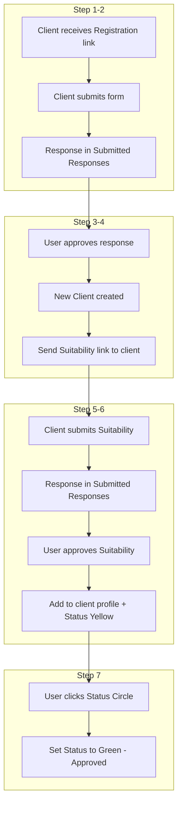

# Business Requirements Document (BRD)
## Vanilla Backoffice — Onboarding Integration Update

**Version:** 2.0  
**Date:** March 5, 2025  
**Status:** Draft  
**Author:** Product / Engineering

---

## CRITICAL: Code Language Convention

**All code must be in English.** Portuguese is only for user-facing display via i18n.

- **Code:** Variables, enum values, object keys, type names, function names — English only
- **Display:** Use i18n keys (e.g., `clients.propertyRegime`) — translations in `src/i18n/translations.ts` provide PT/EN labels
- **Examples:**
  - Code: `civilStatus: 'single' | 'married' | 'divorced' | 'widow'` — not `'solteiro'`, `'casado'`
  - Code: `propertyRegime: 'separate' | 'community' | 'partial_community' | 'participation_in_acquets'` — not Portuguese labels
  - Display: `t('clients.single')` → "Single" (EN) or "Solteiro(a)" (PT)
- The BRD specifies **code values** in English; Appendix B lists translation keys for PT/EN labels only

---

## 1. Executive Summary

### 1.1 Purpose

This document defines the requirements for a major update to the Vanilla Capital Backoffice application. The primary goal is to integrate the **automated onboarding process** end-to-end: from client registration through suitability assessment to contract signing.

### 1.2 Problem Statement

The current system has disconnected flows: Registration Forms are PDF-only, Suitability Form responses are not linked to clients, and there is no status tracking for onboarding progress. Clients and compliance users lack visibility into where each client stands in the onboarding pipeline.

### 1.3 Solution Overview

Connect Registration Forms → Suitability Forms → Service Agreements into a coherent flow; introduce Client **Status** tracking; reorganize the Compliance area with a visual onboarding track; convert Registration Forms to fixed digital forms with shareable links; add question weights to Suitability Form for scoring; fix the Suitability Form fill link bug.

### 1.4 Success Metrics

- Clients can complete Registration and Suitability via shareable links without manual handoff
- Compliance users see all submitted responses and can approve them to create/update clients
- Client Status is visible and manually updatable on the Clients page
- All form links (Registration and Suitability) work correctly in any browser context

### 1.5 Assumptions

- App runs as SPA with React Router; no server-side rendering
- Data persistence uses localStorage (or equivalent) for this phase
- Email sending (Suitability link) may be manual copy-paste or placeholder for future integration
- Backend API integration is out of scope; all data stored client-side

### 1.6 Dependencies

- Existing `CompliancePage`, `ClientsPage`, `SuitabilityFormBuilder`, `SuitabilityFormFill`
- i18n infrastructure (`LanguageContext`, `translations.ts`)
- Client type definitions (`src/types/client.ts`)

---

## 2. Scope & Objectives

### 2.1 In Scope

- End-to-end onboarding workflow integration
- New Client **Status** attribute and UX (colored circle, click to change)
- Compliance page reorganization (Onboarding sequence + Suitability Policies move to Corporate)
- Fixed Registration Forms (PF, PJ, Family) with shareable links, proper types and masks
- Suitability Form question weights and Total Suitability Weight calculation
- Suitability approval → add Suitability Answers section to client profile
- Bug fix: Suitability Form fill link displaying empty

### 2.2 Out of Scope (Future)

- **ClickSign integration** for automatic status change when Service Agreement is signed
- Full email automation backend (SendGrid, etc.) — link may be copied manually
- Status change remains **manual** for this release
- Backend database — localStorage or in-memory store for now

---

## 3. Detailed Onboarding Flow

### 3.1 High-Level Sequence



### 3.2 Step-by-Step Specification

| Step | Actor | Trigger | Preconditions | Actions | Postconditions | Error/Edge Cases |
|------|-------|---------|---------------|---------|----------------|------------------|
| **1** | Client | Receives link (email/manual) | Link is valid | Fills Registration Form (PF, PJ, or Family) with required fields | Response submitted | Invalid link → show error; duplicate CPF on submit → warn |
| **2** | System | Form submit | All required fields valid | Save response to store; show success | Response appears in Submitted Responses for that form type | Store failure → retry or error message |
| **3** | User (Compliance) | Opens Compliance → Registration → Submitted Responses | Response exists | Clicks "Approve" on response card | New Client created with mapped attributes; `status: 'pending_suitability'` | Duplicate CPF → reject or warn; partial data → block approval |
| **4** | System/User | After approval | Client created | User copies Suitability link (or system sends email) | Client receives link | Email out of scope → manual copy for now |
| **5** | Client | Opens Suitability link | Form configured with questions | Fills name, CPF, email + answers questions | Response submitted | Form not found → show "Form not configured"; no questions → show message |
| **6** | User (Compliance) | Opens Compliance → Suitability → Submitted Responses | Response exists | Clicks "Approve"; selects or confirms matching client (by CPF) | Suitability Answers + Total Weight added to client; `status: 'pending_contract'` | No client match → show warning; allow manual client pick |
| **7** | User | Clicks Status Circle on Clients page | Client has status | Opens status selector; selects "Approved" | `status: 'approved'` | — |

### 3.3 Data Flow

- **Registration Response** → `RegistrationResponse` (formType, answers, submittedAt)
- **Approval** → `Client` (id, ...attributes from response, status: pending_suitability)
- **Suitability Response** → `SuitabilityResponse` (formId, answers, submittedAt)
- **Suitability Approval** → Update `Client` (suitabilityAnswers, totalSuitabilityWeight, status: pending_contract)
- **Status Change** → Update `Client.status` to `approved`

---

## 4. Client Status — Full Specification

### 4.1 Enum Values (Code)

```ts
type ClientOnboardingStatus = 'pending_suitability' | 'pending_contract' | 'approved'
```

### 4.2 Display Mapping

| Status (code) | Display Label (i18n) | Color | Hex (suggested) |
|---------------|----------------------|-------|------------------|
| `pending_suitability` | Pending Suitability | Purple | `#7C3AED` or similar |
| `pending_contract` | Pending Contract | Yellow | `#EAB308` or similar |
| `approved` | Approved | Green | `#22C55E` or similar |

*Note: Align with Vanilla brand; secondary is `#C8B991`.*

### 4.3 UX

- **Placement:** Colored circle to the **left** of client name
- **Size:** ~12px diameter, visible in list and profile
- **Click behavior:** Opens status selector (dropdown or inline) allowing manual change
- **Locations:** Clients list table (new Status column or beside Name), Clients profile sidebar, profile header

### 4.4 Defaults and Transitions

- **New client from Registration approval:** `status: 'pending_suitability'`
- **After Suitability approval:** `status: 'pending_contract'` (Yellow)
- **After manual approval:** `status: 'approved'` (Green)

**Allowed transitions:**
- `pending_suitability` → `pending_contract` (system, on Suitability approval)
- `pending_suitability` → `approved` (manual)
- `pending_contract` → `approved` (manual)

---

## 5. Suitability Answers — Complete Data Model

### 5.1 Structure

```ts
// On Client entity
suitabilityAnswers?: Record<string, number>  // questionId → weight
totalSuitabilityWeight?: number
```

### 5.2 Calculation

1. User selects answer for each question (stored as answer text in `SuitabilityResponse.answers`)
2. On approval, resolve each selected answer to its weight from the form definition
3. `suitabilityAnswers[questionId] = weight` for each question
4. `totalSuitabilityWeight = sum(Object.values(suitabilityAnswers))`

### 5.3 Profile Display

- **Section name:** "Suitability Answers" (i18n key)
- **Attributes:** `Question One Weight`, `Question Two Weight`, ... (one per question, in order), then `Total Suitability Weight`
- Use question title or index for label when displaying

---

## 6. Compliance Page — Detailed Reorganization

### 6.1 Suitability Policies Move

- **Remove** `suitability-policies` from `COMPLIANCE_GROUPS.onboarding`
- **Add** to `COMPLIANCE_GROUPS.corporate` as **first item**

### 6.2 Onboarding Sequence with Track Line

**Order:**

1. **Registration Form** (expandable)
   - Individual (PF) — `form-pf`
   - Legal Entity (PJ) — `form-pj`
   - Family Group — `form-family`

2. **Suitability Form** — `suitability-form` (single item, not expandable)

3. **Service Agreement (Contract)** (expandable)
   - Individual — `contract-pf`
   - Legal Entity — `contract-pj`
   - Family Group — `contract-family`

**Visual:**
- Vertical track line connecting steps 1 → 2 → 3
- Each step has step number (1, 2, 3), label, track segment
- Registration and Service Agreement: expand/collapse icon; click to show/hide sub-items
- Sub-items indented under parent

### 6.3 Reference

Current structure: `src/data/complianceDocuments.ts`

---

## 7. Suitability Form — Question Weight Specification

### 7.1 Data Model Change

**Before:**
```ts
answers: [string, string, string, string]
```

**After:**
```ts
interface SuitabilityAnswerOption {
  text: string
  weight: number
}
answers: SuitabilityAnswerOption[]
```

### 7.2 Builder UI

- Each question has 1–4 (or more) answer options
- Each answer row: **text input** (answer text) + **integer weight input**
- Validation: weight required, integer, >= 0
- At least one non-empty answer required per question

### 7.3 Fill Page

- Display answers as radio options (text only; weight hidden)
- On submit, store `answers: Record<questionId, selectedAnswerText>`
- Weight resolution happens at approval time using form definition

### 7.4 Total Weight Formula

`totalSuitabilityWeight = sum(weight for each selected answer, looked up from form)`

---

## 8. Registration Form — Fixed Forms (PF, PJ, Family)

### 8.1 Code Language Convention

All field values (civilStatus, propertyRegime, accountType, etc.) are **English in code**. Labels displayed to user come from i18n (PT/EN).

### 8.2 PF (Individual) — Field Specification

| Field | Type | Mask/Format | Validation | Maps to Client |
|-------|------|-------------|------------|----------------|
| name | string | — | required | client.name |
| cpf | string | 000.000.000-00 | 11 digits, valid CPF | client.cpf |
| idDocument | string | 00.000.000-0 (optional) | optional | client.idDocument |
| birthDate | date | DD/MM/YYYY | valid date | client.birthDate |
| civilStatus | single-select | Values: `single`, `married`, `divorced`, `widow` (labels via i18n) | required | client.civilStatus |
| propertyRegime | single-select | Values: `separate`, `community`, `partial_community`, `participation_in_acquets` (labels via i18n) | conditional (if married) | client.maritalInfo.propertyRegime |
| spouseName | string | — | if married | client.maritalInfo.spouseName |
| spouseCpf | string | 000.000.000-00 | if married | client.maritalInfo.spouseCpf |
| spouseId | string | — | if married | client.maritalInfo.spouseId |
| spouseBirthDate | date | DD/MM/YYYY | if married | client.maritalInfo.spouseBirthDate |
| phone | string | (00) 00000-0000 or (00) 0000-0000 | required | client.phone |
| email | string | — | required, valid email | client.email |
| postalCode | string | 00000-000 | 8 digits | client.postalCode |
| address | string | — | required | client.address |
| addressNumber | number | — | required | client.addressNumber |
| addressComplement | string | — | optional | client.addressComplement |
| uf | single-select | AC, AL, ... TO (see BRAZILIAN_STATES) | required | client.uf |
| city | string | — | required | client.city |
| bank | string or select | — | required | client.bank |
| bankCode | string | 000 | 3 digits | client.bankCode |
| accountType | single-select | Values: `checking`, `saving` (labels via i18n) | required | client.accountType |
| agency | string | — | required | client.agency |
| accountNumber | string | — | required | client.accountNumber |

### 8.3 PJ (Legal Entity) — Field Specification

| Field | Type | Mask/Format | Validation | Maps to Client / Entity |
|-------|------|-------------|------------|-------------------------|
| companyName | string | — | required | client.name (or entity name) |
| cnpj | string | 00.000.000/0001-00 | 14 digits, valid CNPJ | client.cpf (or entity cnpj) |
| legalRepresentative | string | — | required | — |
| representativeCpf | string | 000.000.000-00 | required | — |
| representativeEmail | string | — | required | client.email |
| representativePhone | string | (00) 00000-0000 | required | client.phone |
| address, postalCode, city, uf | same as PF | — | — | client.* |
| bank, bankCode, accountType, agency, accountNumber | same as PF | — | — | client.* |

*Note: PJ client entity may extend or differ; define exact mapping per business rules.*

### 8.4 Family Group — Field Specification

- **Primary holder:** Same fields as PF (or subset)
- **Family members:** Array of (name, cpf, relationship) — structure TBD per business rules
- Shareable link for family group form type

### 8.5 Shareable Links

- **Route:** `/registration/fill/:formType` where `formType` = `pf` | `pj` | `family`
- **URL format:** `${window.location.origin}/registration/fill/${formType}` (absolute, no pathname concatenation bug)
- **Copy button:** Copies correct URL to clipboard
- Form renders all questions/options; client submits; response stored in `registrationResponses` store

---

## 9. Registration Approval and Client Creation

- Submitted responses appear in "Submitted Responses" for each Registration form (PF, PJ, Family)
- Each response card shows: submitted timestamp, all answers, **Approve** button
- **On Approve:** Map response fields → Client; create client with `status: 'pending_suitability'`; store client in clients store; optionally mark response as approved (link to clientId)
- **Duplicate CPF:** Reject approval with warning, or allow override with confirmation (business decision)
- **Validation:** Ensure all required fields present before allowing approval

---

## 10. Suitability Link Email and Matching

### 10.1 Link Delivery

- After Registration approval: User has action "Send Suitability Link" or "Copy Suitability Link"
- Link: `${origin}/suitability/fill/default-suitability-form` (or client-specific token if implemented later)
- Email sending: Out of scope for this phase; user copies and sends manually

### 10.2 Client Matching

- Suitability response includes: name, cpf, email (from fill page)
- **Matching logic:** Primary = CPF (normalize to digits); fallback = email
- On approval, lookup client by CPF; if multiple matches, show picker
- If no match: Show warning; allow user to select client from list or create new (edge case)

---

## 11. Bug Fix — Suitability Form Fill Link Empty

### 11.1 Issue

`http://localhost:5173/suitability/fill/default-suitability-form` appears empty even when questions exist.

### 11.2 Root Cause Analysis

| # | Cause | Fix |
|---|-------|-----|
| 1 | **Copy link bug:** `copyLink` uses `window.location.pathname` — when on `/compliance`, produces `.../compliance/suitability/fill/...` which is invalid (route does not exist) | Use `${window.location.origin}/suitability/fill/${DEFAULT_FORM_ID}` for both copy and display |
| 2 | **Form not found:** `getForm(formId)` returns null if form not in localStorage. Form is only created when Compliance → Suitability Form is opened | Seed default form on first app load, or show "Form not yet configured" with instructions |
| 3 | **Empty answers:** `q.answers.filter(Boolean)` — if all answers are empty, no radios render; question appears blank | Require at least one non-empty answer before form can be saved; or show placeholder message per question |
| 4 | **Storage context:** Incognito or different origin — localStorage not shared | Document that form must be configured in same browser/session; or implement form seeding |

### 11.3 Required Fix

Ensure that when a user creates questions in the Suitability Form Builder and opens the fill link (correct URL), the form loads and displays those questions correctly.

---

## 12. Data Model — Complete Schema Updates

### 12.1 Client (extend `src/types/client.ts`)

```ts
// Add to Client interface
status: ClientOnboardingStatus  // 'pending_suitability' | 'pending_contract' | 'approved'
suitabilityAnswers?: Record<string, number>  // questionId → weight
totalSuitabilityWeight?: number
```

### 12.2 Suitability (`src/types/suitability.ts`)

```ts
interface SuitabilityAnswerOption {
  text: string
  weight: number
}

interface SuitabilityQuestion {
  id: string
  title: string
  answers: SuitabilityAnswerOption[]  // was [string, string, string, string]
}
```

### 12.3 Registration (new)

```ts
type RegistrationFormType = 'pf' | 'pj' | 'family'

interface RegistrationResponse {
  id: string
  formType: RegistrationFormType
  answers: Record<string, string | number>
  submittedAt: string
  approvedClientId?: string  // set when approved
}

// registrationStore.ts: getResponses(formType), saveResponse, approveResponse
```

---

## 13. Acceptance Criteria — Granular Checklist

### 13.1 Registration Forms

- [ ] PF form renders with all fields, correct types, and masks
- [ ] PJ form renders with PJ-specific fields
- [ ] Family form renders (structure as defined)
- [ ] Each form validates required fields before submit
- [ ] Submit saves response to store
- [ ] Response appears in Submitted Responses for that form type
- [ ] Shareable link works: `/registration/fill/pf` (and pj, family) loads form
- [ ] Copy link button produces correct absolute URL

### 13.2 Registration Approval

- [ ] Approve button visible on each response card
- [ ] Approve creates new Client with mapped attributes
- [ ] New client has `status: 'pending_suitability'`
- [ ] Duplicate CPF handled (reject or warn as specified)

### 13.3 Suitability Form

- [ ] Builder: each answer has text + weight input
- [ ] Weight validation: integer, >= 0
- [ ] At least one answer per question required
- [ ] Fill page loads and shows questions when link opened
- [ ] Fill page shows radio options for each question
- [ ] Submit saves response
- [ ] Response appears in Submitted Responses

### 13.4 Suitability Approval

- [ ] Approve matches response to client (by CPF)
- [ ] Approve adds Suitability Answers section to client profile
- [ ] Total Suitability Weight calculated and stored
- [ ] Client status set to `pending_contract` (Yellow)

### 13.5 Client Status

- [ ] Status circle visible on Clients list (left of name)
- [ ] Status circle visible on Clients profile
- [ ] Clicking circle opens status selector
- [ ] User can change status to Approved (Green) manually
- [ ] Colors: Purple (pending_suitability), Yellow (pending_contract), Green (approved)

### 13.6 Compliance Page

- [ ] Suitability Policies in Corporate area (first item)
- [ ] Onboarding shows track line with steps 1, 2, 3
- [ ] Registration Form expandable (PF, PJ, Family)
- [ ] Suitability Form single item
- [ ] Service Agreement expandable (Individual, Legal Entity, Family Group)

### 13.7 Bug Fix

- [ ] Suitability fill link `.../suitability/fill/default-suitability-form` loads form
- [ ] Questions display when form has questions
- [ ] Copy link produces correct URL (no pathname bug)

---

## 14. Appendices

### Appendix A: Brazilian Masks Reference

| Field | Format | Example | Digits |
|-------|--------|---------|--------|
| CPF | 000.000.000-00 | 123.456.789-00 | 11 |
| CNPJ | 00.000.000/0001-00 | 12.345.678/0001-90 | 14 |
| CEP | 00000-000 | 01310-100 | 8 |
| Phone (cell) | (00) 00000-0000 | (11) 98765-4321 | 11 |
| Phone (landline) | (00) 0000-0000 | (11) 3456-7890 | 10 |
| RG | 00.000.000-0 | 12.345.678-9 | varies |
| Date | DD/MM/YYYY | 15/03/1985 | — |

### Appendix B: i18n Keys for Select Options

**Code values (English) → Translation keys**

| Field | Code Values | i18n Key Pattern |
|-------|-------------|------------------|
| civilStatus | single, married, divorced, widow | clients.single, clients.married, etc. |
| propertyRegime | separate, community, partial_community, participation_in_acquets | clients.separateProperty, clients.communityProperty, etc. |
| accountType | checking, saving | clients.checkingAccount, clients.savingAccount |
| status | pending_suitability, pending_contract, approved | clients.statusPendingSuitability, etc. |

*Add new keys to `translations.ts` for PT/EN labels.*

### Appendix C: File Structure Changes

**New files:**
- `src/data/registrationStore.ts`
- `src/types/registration.ts`
- `src/pages/RegistrationFormFill.tsx`
- `src/components/RegistrationFormBuilder.tsx` (or inline in Compliance for each type)

**Modified files:**
- `src/types/client.ts` — add status, suitabilityAnswers, totalSuitabilityWeight
- `src/types/suitability.ts` — SuitabilityAnswerOption
- `src/data/complianceDocuments.ts` — move suitability-policies; restructure onboarding
- `src/components/SuitabilityFormBuilder.tsx` — add weight inputs; fix copy link
- `src/pages/SuitabilityFormFill.tsx` — handle empty answers; ensure form loads
- `src/pages/CompliancePage.tsx` — track line; expandable sections; Registration form types
- `src/pages/ClientsPage.tsx` — Status circle; Status selector
- `src/App.tsx` — add route `/registration/fill/:formType`
- `src/i18n/translations.ts` — new keys for status, registration, etc.

### Appendix D: Document History

| Version | Date | Author | Changes |
|---------|------|--------|---------|
| 1.0 | 2025-03-05 | — | Initial BRD |
| 2.0 | 2025-03-05 | — | Detailed expansion: flow, status, forms, bug fix, appendices |
