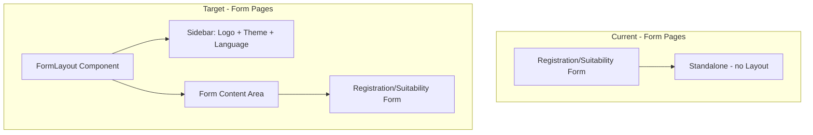

# High-Level Design (HLD)
## Vanilla Backoffice — Form Pages Brand Design

**Version:** 1.0  
**Date:** March 5, 2025  
**Status:** Draft  
**Baseline BRD:** [BRD-Form-Pages-Brand-Design.md](./BRD-Form-Pages-Brand-Design.md) v1.0

---

## 1. Document Purpose

This HLD translates the BRD into a technical architecture and design specification. It defines component structure, routing changes, and implementation approach for aligning the Registration and Suitability form fill pages with Vanilla Capital's brand design.

---

## 2. System Overview

### 2.1 Architecture Changes



### 2.2 Updated Route Structure

| Route | Component | Layout | Notes |
|-------|-----------|--------|-------|
| `/` | MainPage | Yes (Layout) | — |
| `/clients` | ClientsPage | Yes (Layout) | — |
| `/compliance` | CompliancePage | Yes (Layout) | — |
| `/registration/fill/:formType` | RegistrationFormFill | Yes (FormLayout) | Branded sidebar + diagonal background |
| `/suitability/fill/:formId` | SuitabilityFormFill | Yes (FormLayout) | Branded sidebar + diagonal background |

*Form fill routes now use FormLayout (sidebar + branded background) instead of rendering standalone.*

---

## 3. Component Design

### 3.1 New Component: FormLayout

**Location:** `src/components/FormLayout.tsx`

**Purpose:** Provide a branded shell for form fill pages with sidebar (logo, theme toggle, language switcher) and diagonal-line background on the content area.

**Props:**
```tsx
interface FormLayoutProps {
  children: React.ReactNode
}
```

**Structure:**
- Root: `min-h-screen flex bg-[var(--bg-primary)]` (same as Layout)
- **Sidebar (left):**
  - Width: `w-56` (same as Layout)
  - Logo: theme-aware (`/logos/LOGO LIGHT VERSION.svg` | `/logos/LOGO DARK VERSION.svg`)
  - No nav links (client-facing; backoffice routes not included)
  - Footer: theme toggle + LanguageSwitcher (same as Layout)
- **Main (right):**
  - `flex-1 overflow-auto`
  - Diagonal lines background (CSS utility class)
  - Children (form content) rendered inside

**Dependencies:** `useTheme`, `useLanguage`, `ThemeContext`, `LanguageContext`, `LanguageSwitcher`

### 3.2 Diagonal Lines Background

**Implementation:** CSS utility class in `src/index.css`

**Approach:** `repeating-linear-gradient` for thin diagonal stripes:
- Angle: ~45deg or -45deg
- Color: `var(--vanilla-secondary)` at low opacity (5–10%)
- Spacing: thin lines with gaps (e.g., 1–2px lines, 20–40px repeat)
- Light/dark: Works with both themes via CSS variables

**Class name:** `form-page-bg-pattern` (or similar)

**Applied to:** Main content area of FormLayout (wrapper around `children`)

---

## 4. Page Modifications

### 4.1 RegistrationFormFill

**File:** `src/pages/RegistrationFormFill.tsx`

**Changes:**
1. Remove `languageSelector` (moves to FormLayout sidebar)
2. Remove `min-h-screen` and outer `bg-[var(--bg-primary)]` from root; FormLayout provides structure
3. Change subtitle from hardcoded `"Vanilla Capital"` to `t('registration.formSubtitle')`
4. Keep form content structure; wrap in a container that works within FormLayout main area
5. Error/loading/submitted states: each still wrapped in appropriate container; FormLayout wraps the whole page

**Structure after change:**
```tsx
// App.tsx wraps with <FormLayout><RegistrationFormFill /></FormLayout>
// RegistrationFormFill returns:
<div className="py-12 px-4">
  <div className="max-w-xl mx-auto">
    <h1>...</h1>
    <p>{t('registration.formSubtitle')}</p>
    <form>...</form>
  </div>
</div>
```

### 4.2 SuitabilityFormFill

**File:** `src/pages/SuitabilityFormFill.tsx`

**Changes:** Same pattern as RegistrationFormFill
1. Remove `languageSelector`
2. Remove root min-h-screen/background
3. Change subtitle to `t('suitabilityFill.formSubtitle')`
4. Adjust structure for FormLayout

**Edge cases:** Invalid form link, form not found, submitted state — all rendered inside FormLayout; ensure proper centering and styling for each.

---

## 5. Routing Change

**File:** `src/App.tsx`

**Before:**
```tsx
<Route path="/registration/fill/:formType" element={<RegistrationFormFill />} />
<Route path="/suitability/fill/:formId" element={<SuitabilityFormFill />} />
```

**After:**
```tsx
<Route path="/registration/fill/:formType" element={<FormLayout><RegistrationFormFill /></FormLayout>} />
<Route path="/suitability/fill/:formId" element={<FormLayout><SuitabilityFormFill /></FormLayout>} />
```

---

## 6. i18n Updates

**File:** `src/i18n/translations.ts`

| Key | EN | PT |
|-----|----|----|
| `registration.formSubtitle` | Client's information registration Questionary | Questionário de cadastro de informações do cliente |
| `suitabilityFill.formSubtitle` | Client's Investments Profile Questionary | Questionário de perfil de investimentos do cliente |

Add under existing `registration` and `suitabilityFill` objects.

---

## 7. File Change Summary

| Action | File |
|--------|------|
| Create | `docs/BRD-Form-Pages-Brand-Design.md` |
| Create | `docs/HLD-Form-Pages-Brand-Design.md` |
| Create | `src/components/FormLayout.tsx` |
| Modify | `src/App.tsx` — wrap form routes with FormLayout |
| Modify | `src/pages/RegistrationFormFill.tsx` — subtitle, remove language selector, adjust structure |
| Modify | `src/pages/SuitabilityFormFill.tsx` — subtitle, remove language selector, adjust structure |
| Modify | `src/i18n/translations.ts` — add formSubtitle keys |
| Modify | `src/index.css` — add diagonal lines utility class |

---

## 8. Success Criteria

- Both form pages display sidebar with Vanilla logo (light/dark theme-aware)
- Theme toggle and language switcher present in form sidebar
- Subtitles display new questionnaire descriptions ( localized EN/PT)
- Diagonal lines visible in form content background (subtle, non-distracting)
- Existing form behavior, validation, and submission logic unchanged
- Invalid form link, form not found, and thank-you states render correctly with new layout
