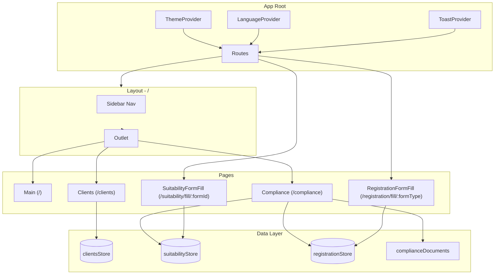
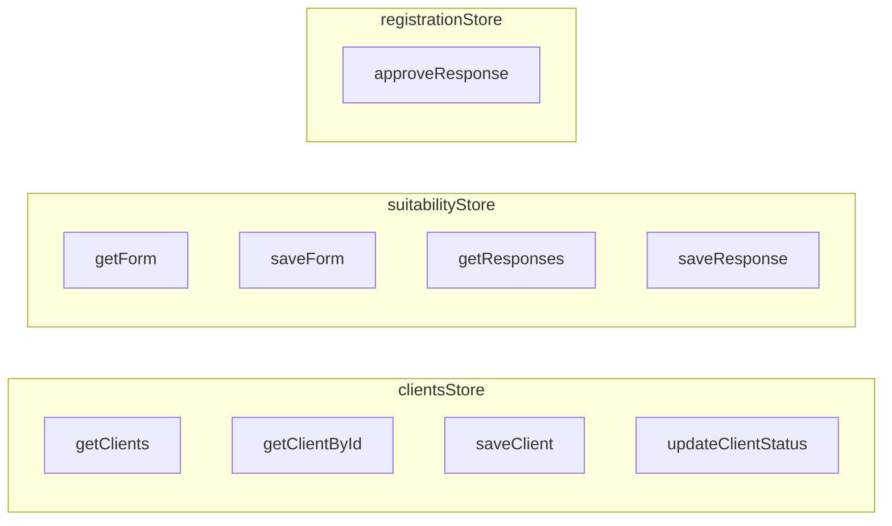
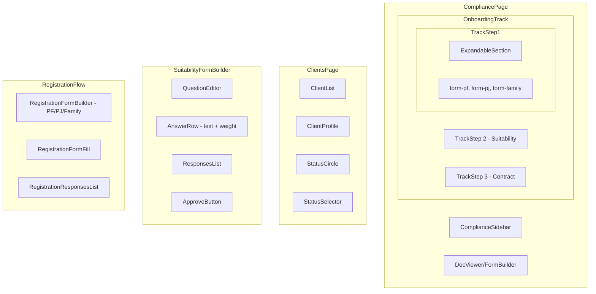
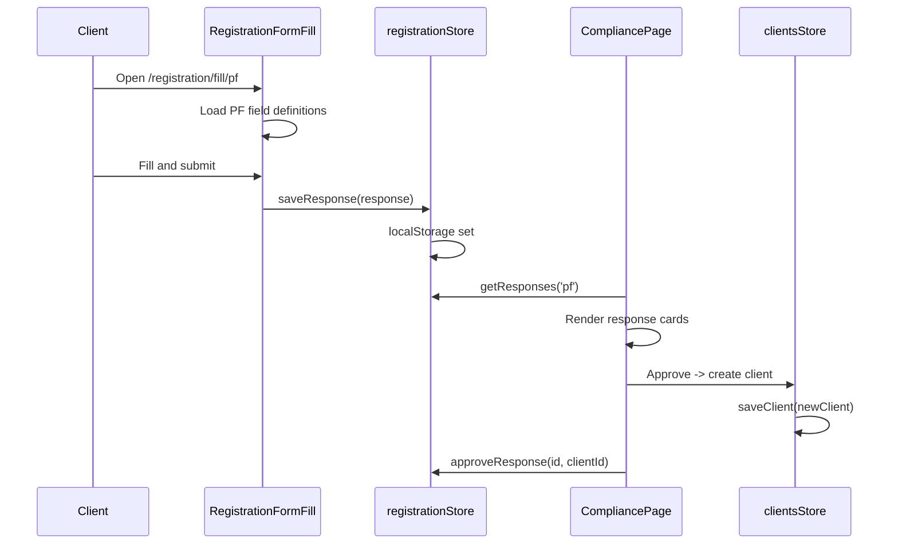
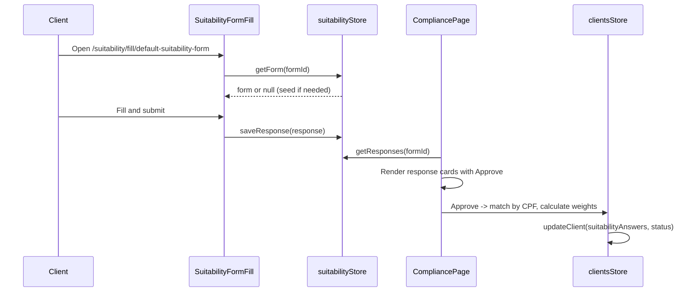

# High-Level Design (HLD)
## Vanilla Backoffice — Onboarding Integration Update

**Version:** 1.0  
**Date:** March 5, 2025  
**Status:** Draft  
**Baseline BRD:** [BRD-Onboarding-Integration.md](./BRD-Onboarding-Integration.md) v2.0

---

## 1. Document Purpose

This HLD translates the BRD into a technical architecture and design specification. It defines component structure, data flows, interfaces, and implementation approach for the onboarding integration update.

---

## 2. System Overview

### 2.1 Architecture Style

- **SPA (Single-Page Application)** — React + Vite
- **Client-side routing** — React Router v6
- **Client-side persistence** — localStorage (no backend in scope)
- **Context-based state** — ThemeContext, LanguageContext, ToastContext

### 2.2 High-Level Component Diagram



### 2.3 Route Structure

| Route | Component | Layout | Auth |
|-------|-----------|--------|------|
| `/` | MainPage | Yes | — |
| `/clients` | ClientsPage | Yes | — |
| `/compliance` | CompliancePage | Yes | — |
| `/registration/fill/:formType` | RegistrationFormFill | No (standalone for client) | — |
| `/suitability/fill/:formId` | SuitabilityFormFill | No (standalone for client) | — |

*Form fill routes render outside Layout so clients see a minimal, branded form screen without backoffice UI.*

---

## 3. Technology Stack

| Layer | Technology | Notes |
|-------|------------|-------|
| Framework | React 18 | — |
| Build | Vite 5 | — |
| Routing | React Router 6 | — |
| Styling | Tailwind CSS | Utility-first |
| Language | TypeScript 5.6 | Strict mode |
| State | localStorage + React state | No Redux/Zustand |
| i18n | Custom (translations.ts + LanguageContext) | PT/EN |

---

## 4. Data Layer Design

### 4.1 localStorage Keys

| Key | Content | Structure |
|-----|---------|-----------|
| `vanilla-clients` | Client entities | `Client[]` |
| `vanilla-suitability-forms` | Suitability form definitions | `SuitabilityFormData[]` |
| `vanilla-suitability-responses` | Suitability submissions | `SuitabilityResponse[]` |
| `vanilla-registration-responses` | Registration submissions | `RegistrationResponse[]` |

### 4.2 Store Modules



### 4.3 clientsStore (new or extend mockClients)

**Location:** `src/data/clientsStore.ts` (new) or extend `mockClients.ts` with persistence.

**API:**
```ts
getClients(): Client[]
getClientById(id: string): Client | null
getClientByCpf(cpf: string): Client[]
saveClient(client: Client): void
updateClient(id: string, updates: Partial<Client>): void
updateClientStatus(id: string, status: ClientOnboardingStatus): void
```

**Initial data:** Seed from `mockClients` if `vanilla-clients` empty.

### 4.4 suitabilityStore (existing, extend)

**Location:** `src/data/suitabilityStore.ts`

**Changes:**
- Seed default form on first access if not exists
- No API changes; add `seedDefaultForm()` for initialization

### 4.5 registrationStore (new)

**Location:** `src/data/registrationStore.ts`

**API:**
```ts
getResponses(formType: RegistrationFormType): RegistrationResponse[]
saveResponse(response: RegistrationResponse): void
approveResponse(responseId: string, clientId: string): void
getResponseById(id: string): RegistrationResponse | null
```

---

## 5. Type Definitions

### 5.1 Client Extensions (`src/types/client.ts`)

```ts
export type ClientOnboardingStatus = 'pending_suitability' | 'pending_contract' | 'approved'

// Add to Client interface:
status: ClientOnboardingStatus
suitabilityAnswers?: Record<string, number>
totalSuitabilityWeight?: number
```

### 5.2 Suitability Extensions (`src/types/suitability.ts`)

```ts
export interface SuitabilityAnswerOption {
  text: string
  weight: number
}

export interface SuitabilityQuestion {
  id: string
  title: string
  answers: SuitabilityAnswerOption[]
}

// SuitabilityResponse unchanged: answers still Record<string, string> (selected text)
```

### 5.3 Registration Types (`src/types/registration.ts` — new)

```ts
export type RegistrationFormType = 'pf' | 'pj' | 'family'

export interface RegistrationResponse {
  id: string
  formType: RegistrationFormType
  answers: Record<string, string | number>
  submittedAt: string
  approvedClientId?: string
}

export interface RegistrationFieldDefinition {
  key: string
  type: 'string' | 'number' | 'select' | 'date'
  mask?: string
  required?: boolean
  options?: { value: string; labelKey: string }[]
  conditional?: { field: string; value: string }
}

export type RegistrationFormDefinition = {
  formType: RegistrationFormType
  fields: RegistrationFieldDefinition[]
}
```

---

## 6. Component Architecture

### 6.1 Component Hierarchy



### 6.2 New Components

| Component | Path | Responsibility |
|-----------|------|----------------|
| `OnboardingTrack` | `components/compliance/OnboardingTrack.tsx` | Renders steps 1–3 with track line and expand/collapse |
| `TrackStep` | `components/compliance/TrackStep.tsx` | Single step with number, label, optional expandable children |
| `StatusCircle` | `components/clients/StatusCircle.tsx` | Colored circle; click opens StatusSelector |
| `StatusSelector` | `components/clients/StatusSelector.tsx` | Dropdown/modal to change status |
| `RegistrationFormFill` | `pages/RegistrationFormFill.tsx` | Public form for PF/PJ/Family; uses field definitions |
| `RegistrationFormBuilder` | `components/compliance/RegistrationFormBuilder.tsx` | Config + Submitted Responses + Approve (or inline in Compliance) |
| `MaskedInput` | `components/forms/MaskedInput.tsx` | Reusable input with CPF, CNPJ, CEP, phone, date masks |

### 6.3 Modified Components

| Component | Changes |
|-----------|---------|
| `SuitabilityFormBuilder` | Add weight input per answer; fix copy link to `${origin}/suitability/fill/...`; add Approve button + client matching |
| `SuitabilityFormFill` | Handle empty answers; ensure form loads (seed if needed); filter answers for display |
| `CompliancePage` | New sidebar structure with OnboardingTrack; Suitability Policies in Corporate; type `form` for Registration (not pdf) |
| `ClientsPage` | Add StatusCircle to list and profile; StatusSelector on click; Suitability Answers section in profile |

---

## 7. Data Flows

### 7.1 Registration Flow



### 7.2 Suitability Flow



### 7.3 Status Change Flow

```mermaid
sequenceDiagram
    participant User
    participant StatusCircle
    participant StatusSelector
    participant clientsStore

    User->>StatusCircle: Click circle
    StatusCircle->>StatusSelector: Open
    User->>StatusSelector: Select "Approved"
    StatusSelector->>clientsStore: updateClientStatus(id, 'approved')
    clientsStore->>clientsStore: localStorage update
    StatusSelector->>StatusCircle: Close; UI re-renders
```

---

## 8. Compliance Page Restructure

### 8.1 Sidebar Structure (Post-Change)

```
ONBOARDING
├── 1. Registration Form [expandable]
│   ├── Individual (PF)
│   ├── Legal Entity (PJ)
│   └── Family Group
├── 2. Suitability Form
└── 3. Service Agreement (Contract) [expandable]
    ├── Individual
    ├── Legal Entity
    └── Family Group

CORPORATE
├── Suitability Policies   ← moved from Onboarding
├── Client's Contract
├── Code of Ethics...
└── ...
```

### 8.2 Document Type Mapping

| Doc ID | Type | Renders |
|--------|------|---------|
| form-pf, form-pj, form-family | `form` | RegistrationFormBuilder (PF/PJ/Family variant) |
| suitability-form | `suitability` | SuitabilityFormBuilder |
| contract-pf, contract-pj, contract-family | `pdf` | PDF upload/viewer |
| suitability-policies, client-contract, ... | `pdf` | PDF upload/viewer |

*Add `type: 'form'` to ComplianceDocument; update COMPLIANCE_GROUPS.*

### 8.3 Track Line UI Spec

- **Layout:** Vertical list, each item has left margin for track
- **Track:** `border-left` or SVG line connecting numbered circles
- **Step:** Circle with number (1, 2, 3) + label; expandable steps have chevron
- **State:** `expandedSteps: Set<number>` to toggle Registration and Contract

---

## 9. Form Implementation Details

### 9.1 Registration Form — Field Rendering

**PF fields** sourced from `REGISTRATION_FIELDS_PF` constant (see BRD Section 8.2).

**Rendering logic:**
- `string` → `<input type="text">` or `<MaskedInput mask="cpf" />` etc.
- `select` → `<select>` with options from i18n
- `date` → `<input type="text">` with DD/MM/YYYY mask
- Conditional fields (e.g., spouse*) shown when `civilStatus === 'married'`

### 9.2 Suitability Form — Weight in Builder

**Answer row structure:**
```tsx
<div className="flex gap-2">
  <input value={opt.text} onChange={...} placeholder="Answer text" />
  <input type="number" min={0} value={opt.weight} onChange={...} placeholder="Weight" />
</div>
```

**Validation:** Before save, ensure `opt.text` non-empty and `opt.weight` is valid integer >= 0.

### 9.3 Weight Calculation on Approval

```ts
function calculateSuitabilityWeights(
  response: SuitabilityResponse,
  form: SuitabilityFormData
): { suitabilityAnswers: Record<string, number>; totalSuitabilityWeight: number } {
  const suitabilityAnswers: Record<string, number> = {}
  for (const [qId, selectedText] of Object.entries(response.answers)) {
    const question = form.questions.find(q => q.id === qId)
    const option = question?.answers.find(a => a.text === selectedText)
    if (option) suitabilityAnswers[qId] = option.weight
  }
  const totalSuitabilityWeight = Object.values(suitabilityAnswers).reduce((a, b) => a + b, 0)
  return { suitabilityAnswers, totalSuitabilityWeight }
}
```

---

## 10. Bug Fix Implementation

### 10.1 Copy Link Fix

**File:** `src/components/SuitabilityFormBuilder.tsx`

**Change:**
```ts
// Before
const url = `${window.location.origin}${window.location.pathname.replace(/\/$/, '')}/suitability/fill/${DEFAULT_FORM_ID}`

// After
const url = `${window.location.origin}/suitability/fill/${DEFAULT_FORM_ID}`
```

### 10.2 Form Seeding

**File:** `src/data/suitabilityStore.ts` or `src/main.tsx`

**Option A — In getForm:**
```ts
export function getForm(id: string): SuitabilityFormData | null {
  const forms = getForms()
  let form = forms.find((f) => f.id === id) ?? null
  if (!form && id === 'default-suitability-form') {
    form = { id, questions: [], createdAt: new Date().toISOString() }
    saveForm(form)
  }
  return form
}
```

**Option B — On app init:** Call `seedDefaultSuitabilityForm()` in `main.tsx` if localStorage empty.

### 10.3 Empty Answers Handling

**File:** `src/pages/SuitabilityFormFill.tsx`

- Filter: `q.answers.filter(a => a.text?.trim())` — support new structure
- If no options: show message "No options configured for this question" or hide question
- Builder: prevent saving question with all empty answers (validation)

---

## 11. i18n Additions

### 11.1 New Keys

```ts
// clients
statusPendingSuitability: 'Pending Suitability'
statusPendingContract: 'Pending Contract'
statusApproved: 'Approved'
suitabilityAnswers: 'Suitability Answers'
totalSuitabilityWeight: 'Total Suitability Weight'
questionWeight: 'Question Weight'

// registration
registrationFormTitle: 'Registration Form'
registrationSubmitSuccess: 'Submitted successfully'
registrationApprove: 'Approve'
registrationCopiedLink: 'Link copied'

// property regime (add 4th option)
participationInAcquets: 'Participation in Acquests'  // EN
// PT: 'Participação Final nos Aquestos'
```

---

## 12. Implementation Phases

### Phase 1: Foundation (Types + Stores)
- Extend `client.ts` with status, suitabilityAnswers, totalSuitabilityWeight
- Extend `suitability.ts` with SuitabilityAnswerOption
- Create `registration.ts` types
- Create `registrationStore.ts`
- Create/extend `clientsStore.ts` with persistence

### Phase 2: Bug Fix + Suitability Weights
- Fix copy link in SuitabilityFormBuilder
- Add form seeding for default form
- Add weight to SuitabilityAnswerOption; update Builder UI
- Handle empty answers in SuitabilityFormFill

### Phase 3: Client Status
- Add StatusCircle component
- Add StatusSelector component
- Integrate into ClientsPage (list + profile)
- Add i18n for status labels

### Phase 4: Compliance Restructure
- Move suitability-policies to Corporate
- Create OnboardingTrack + TrackStep components
- Implement expandable Registration and Contract sections
- Add `form` type for Registration docs

### Phase 5: Registration Forms
- Create RegistrationFormFill page
- Create field definitions for PF (then PJ, Family)
- Create MaskedInput component
- Add route /registration/fill/:formType
- Build RegistrationFormBuilder / Submitted Responses in Compliance

### Phase 6: Approval Flows
- Registration approval → create Client
- Suitability approval → match client, add suitabilityAnswers, update status
- Duplicate CPF handling

### Phase 7: Polish
- Suitability Answers section in client profile
- Copy Suitability Link action after Registration approval
- Final i18n and UX polish

---

## 13. File Change Summary

| Action | Path |
|--------|------|
| Create | `src/types/registration.ts` |
| Create | `src/data/registrationStore.ts` |
| Create | `src/data/clientsStore.ts` |
| Create | `src/pages/RegistrationFormFill.tsx` |
| Create | `src/components/compliance/OnboardingTrack.tsx` |
| Create | `src/components/compliance/TrackStep.tsx` |
| Create | `src/components/clients/StatusCircle.tsx` |
| Create | `src/components/clients/StatusSelector.tsx` |
| Create | `src/components/forms/MaskedInput.tsx` |
| Modify | `src/types/client.ts` |
| Modify | `src/types/suitability.ts` |
| Modify | `src/data/complianceDocuments.ts` |
| Modify | `src/data/suitabilityStore.ts` |
| Modify | `src/components/SuitabilityFormBuilder.tsx` |
| Modify | `src/pages/SuitabilityFormFill.tsx` |
| Modify | `src/pages/CompliancePage.tsx` |
| Modify | `src/pages/ClientsPage.tsx` |
| Modify | `src/App.tsx` |
| Modify | `src/i18n/translations.ts` |

---

## 14. Technical Risks and Mitigations

| Risk | Mitigation |
|------|------------|
| localStorage limit (~5MB) | Monitor size; consider IndexedDB if many responses |
| Form fill outside Layout loses theme/lang | Wrap in ThemeProvider/LanguageProvider at App root (already present) |
| Client matching ambiguity (same CPF) | Show picker when multiple matches; require manual selection |
| Registration form complexity (PJ, Family) | Implement PF first; PJ and Family as incremental additions |

---

## 15. Document History

| Version | Date | Author | Changes |
|---------|------|--------|---------|
| 1.0 | 2025-03-05 | — | Initial HLD based on BRD v2.0 |
